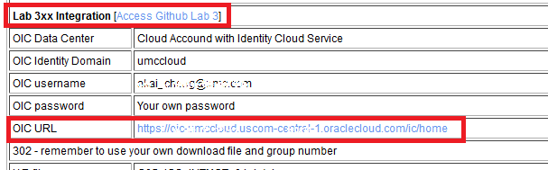
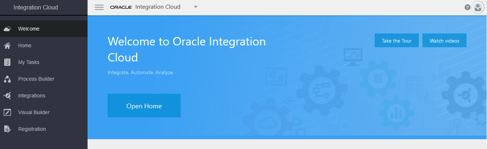
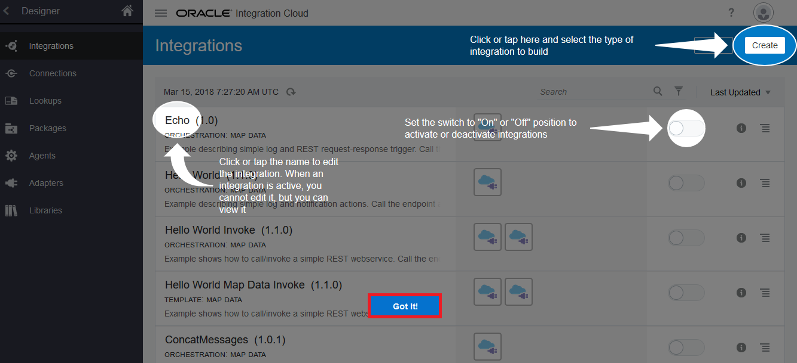
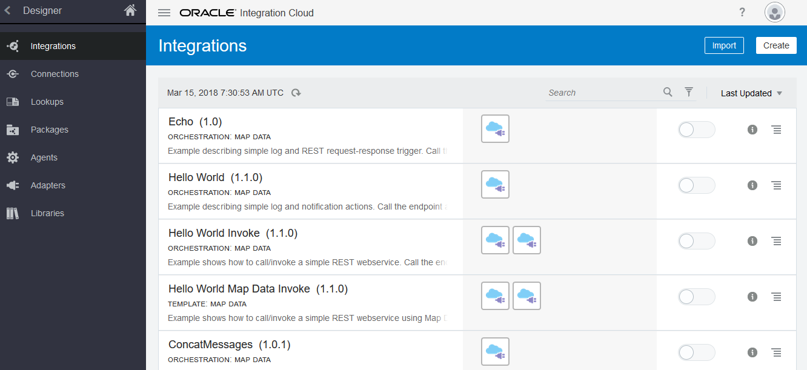
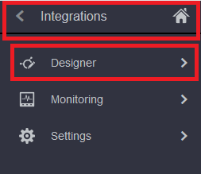

# ORACLE Cloud Test Drive #
-----
## 301: Navigating Oracle Integration Cloud Service ##

### Introduction ###
This tutorial demonstrates how to:
- Navigate in Oracle Integration Cloud Service web-based dashboard

### About the Exercise Today ###
In this exercise, we will:
- Navigate the web-based Integration Cloud Service (ICS) dashboard to familiar with, and experience initially how it differs from traditional application development.

### Prerequisites ###
- Oracle Public Cloud Service account including Integration Cloud Service (Check with instructor if you don't have one)

#### Navigating Oracle Integration Cloud Service ####

1. Refer the access document, click to open the OIC URL at the **Lab 3xx Integration** section:

2. You will be prompted with login page, login using your **Cloud Account with Identity Cloud Service** username and password, which is provided from access document.

3. The OIC home page is displayed as following:

4. Click `Integrations` from the left pane to enter the main Integrations page

  \*Close the **Guide Me** Quick Tour if running by click `Got it!` button at the bottom, we don't need it during the lab exercise.

5. The home page provides links to the primary development features of Oracle Integration Cloud Service: Integrations, Connections, Lookups, Packages, Agents, Adapters and Libraries.

6. Using the Navigation Pane, click  in the upper left corner to show the navigation pane.

The navigation pane provides you with access to all the development features in the Oracle Integration Cloud.

[Procced to Next - 302: Import and Define Connections for CRM Customer Activity Service and REST Service Exposure](302-IntegrationsLab.md)

or

[Back to Integrations Lab Home](README.md)
