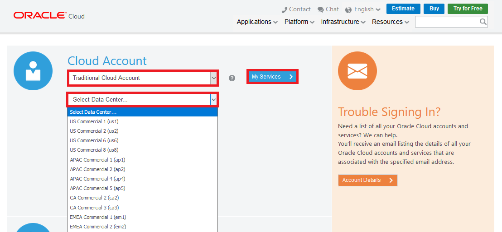
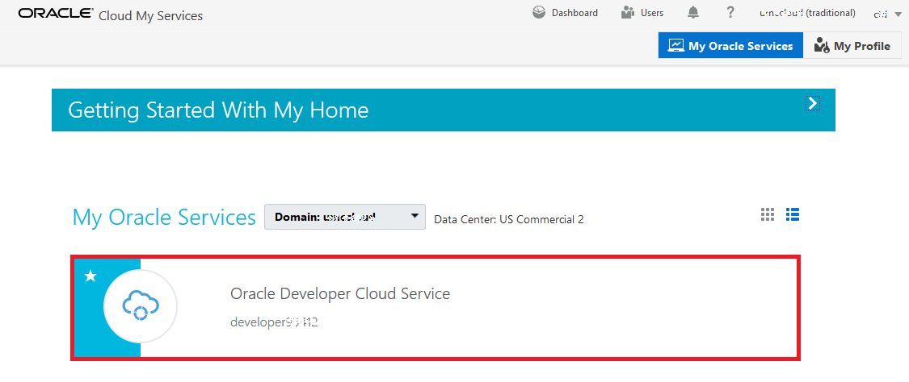

# ORACLE Cloud Test Drive #
-----
## 101: Create Oracle Developer Cloud Service Loyalty Management application project using initial GitHub repository ##

### Introduction ###
This tutorial demonstrates how to:
- Create Oracle Developer Cloud Service project using existing external Git repository - GitHub

### About the Exercise Today ###
In this exercise, we will:
- Create a new Developer Cloud Service Project for the Loyalty Management System
- Create a new Developer Cloud Service Git Repository to store the Loyalty Management Java Application Source Code
- Clone an external Git repository, which is stored in Github, to the Developer Cloud Service Git Repository create above

### Prerequisites ###
- Oracle Public Cloud Service account including Developer Cloud Service (Check with instructor if you don't have one)

----

#### Sign In to Oracle Cloud ####

1. Open a browser and go to [cloud.oracle.com](https://cloud.oracle.com). Click **Sign In**.

2. Follow the lab access document provided by instructor, per each of Lab section, you should be able to locate corresponding datacenter info, for example:  
  
or  
  

Because this is the first Lab 1xx - Java App, we need to login to DevCS and therefore:  
Select `Traditional Cloud Account`, then select    
    `US Commercial 2 (us2)`   
or    
    `EMEA Commercial 2 (em2)`    
according to the datacenter of your environment listed in access document.  Click **My Services** button.

3. Enter the **Developer Cloud Service \(DevCS\)** identity domain and click **Go**. The identity domain and associated credential should be provided by instructor.

4. Enter the DevCS username and password of user with Service Administrator role. Click **Sign In**.

5. After a successful login you will see your Dashboard. Click on the **Oracle Developer Cloud Service**.

Alternatively, you may see another Dashboard layout like below:

On the Dashboard there are predefined tiles for different services. If the **Developer Cloud Service** tile doesn't appear, click **Customize Dashboard** and mark the **developer** service to show on the dashboard.

6. Now, find the Developer Service tile and click the hamburger icon. In the dropdown menu click **Open Service Console**.

#### Create Oracle Developer Cloud Service project ####

7. Log in to Oracle Developer Cloud Service and create a new project.

8. Enter the name of the project and set the desired properties.   
	**Name:** `APAC Cloud Test Drive XX` (XX - Use your assigned ID, e.g. 01)  
	**Description:** `APAC Cloud Test Drive project hub XX` (XX - Use your assigned ID, e.g. 01)  
	and click **Next**

9. Select *Empty Project* as template and click **Next**

10. Choose `MARKDOWN` as Wiki Markup and click **Finish**

11. **Wait** for the Developer Cloud Service Project got provisioned.

12. You will see the project main screen once the project is ready. In the right hand pane, make sure you are in the `Repositories` tab. Click the [ **+ New Repository** ] button to create a new Git repository.

13. Enter the following information for the New Repository   
   Name: `LoyaltyManagement`   
	 Initial content: select `Import existing repository`   
   Enter or copy the `https://github.com/APACTestDrive/LoyaltyManagement.git` as the repository address.   
Click the [ **Create** ] button

14. You have now created a new Git repository with source code stored within the Developer Cloud Service that is based on an existing repository.

You have finished this lab section.

[Procced to Next - 102: Define Continuous Integration 'Build' and 'Deploy' Configuration in Oracle Developer Cloud Service](102-JavaAppsLab.md)

or

[Back to JavaAppsLab Home](README.md)
