Update: November 7, 2017

## 0.1 Introduction

This lab is part of the APAC Cloud Test Drive and is the 2nd lab about creating microservices

## 0.2 Objectives

- Import Code from external Git Repository
- Build and Deploy project using Developer Cloud Service and Oracle Application Container Cloud Services

## 0.3 Required Artifacts

- The following lab requires an Oracle Public Cloud account that will either be applied by yourself or supplied by your instructor.
- IDE environment and GIT client in your local computer in the **previous lab**. The instructions assume you are using Brackets Editor in your local host computer. **The details of installing Brackets Editor are covered in the previous lab** and can also be found [here](../Java%20Apps/brackets.md).

## 0.4 Special Notes

- Please be careful when you copy-n-paste. Additional **WHITE SPACE** *before* or *after* the information you've copied might cause error.

# 1. Create QR Code Generator Microservice

## 1.1 Create Initial Git Repository - QR Code Generator

1. Login to Developer Cloud Service if you haven't done so. If you are in the Cloud Dashboard, you can use Developer Cloud Service Hamburger Menu to navigate to DevCS.

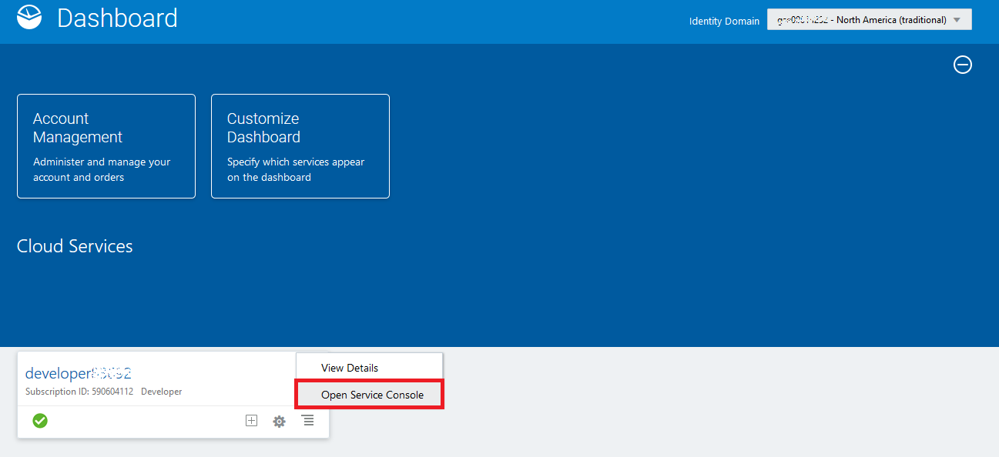

2. The Developer Cloud Service landing page should show the project we've created in the previous lab. Just click the project name and navigate to the project main page.

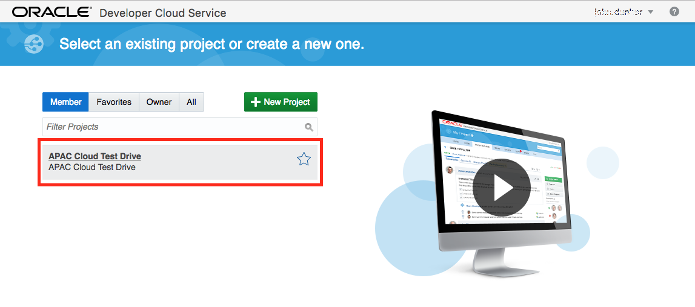

3. **If you are already in Developer Cloud Service, you can go to project main page by clicking `Project` in the `left hand navigation panel`**  

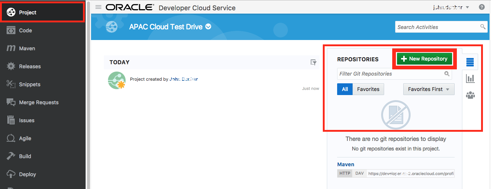

   On the right side in the **REPOSITORIES** section, click on **New Repository** to create a new Git Repository.

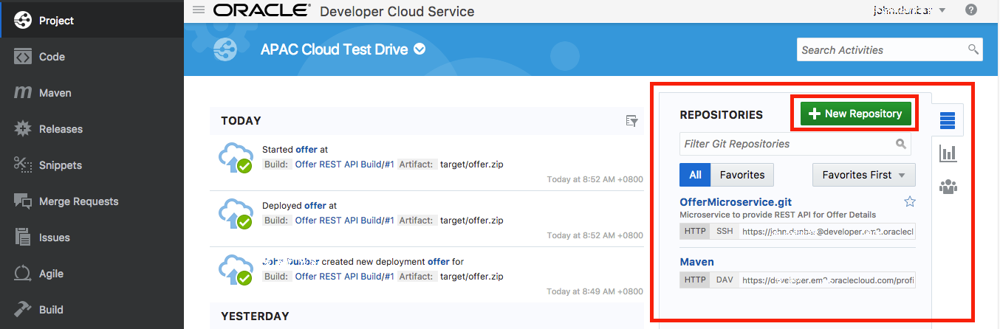

4. In the New Repository wizard enter the following information and click **Create**.

  - **Name:** `QRCodeMicroservice`
  - **Description:** `Microservice to generate Offer QR Code. The QR Code will contains an URL of the actual Offer.`
  - **Initial content:** `Import existing repository`
  - **Enter the URL:** `https://github.com/APACTestDrive/QRCodeMicroservice.git`

```diff
-Please BE CAREFUL that you have not added extra white space before or after the information when copy-n-paste
```


5. You have now created a new Git repository stored within the Developer Cloud Service that is based on an existing repository

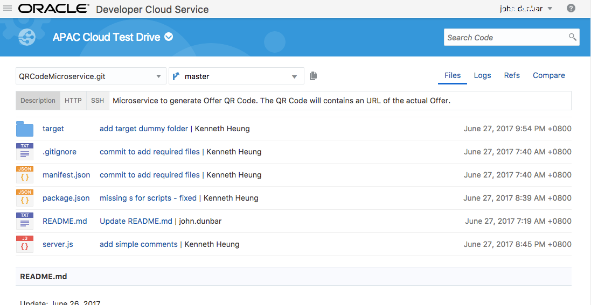

## 2.2 Modify the sample program code to reflect your own environment

### 2.2.1 Clone Project to Bracket Text Editor

This Lab assumes your have direct connection to public Internet, i.e. **NOT behind proxy**

1. Start Brackets Text Editor, by double click the **Brackets** desktop icon, [Start] Menu button, or the correspond short-cut in your computer.


2. In the **File** pull-down menu, choose **Open Folder**


3. Select a desired folder to store the source code in your local harddisk, e.g. **d:\oracle** in the left hand side and click **[Create Folder]** at the top right hand corner - `this will create a new folder under the folder you've selected`.


4. Enter **QRCodeMicroservice** as the folder name. Then Click any space (e.g. in the size column) next to the name


5. Click **[ Open ]** button to open the newly created project folder.


6. Back in **Developer Cloud Service**, in your **QRCodeMicroservice Git Repository**. Click **HTTP** to display the Git HTTP URL, click the **Copy** button to copy the URL.

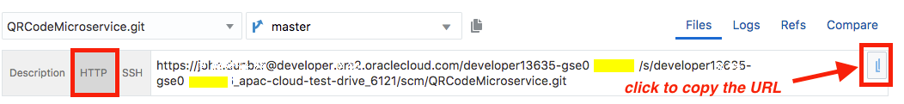

7. Back in the Bracket editor, click on **GIT** icon on the right hand side of the editor.


8. In the Git panel, click **[ Clone ]**


9. Paste the GIT URL that you copied from Developer Cloud Service. Username should be populated automatically. Enter the password and select **Save credentials to remote url**

10. Click **[OK]** button

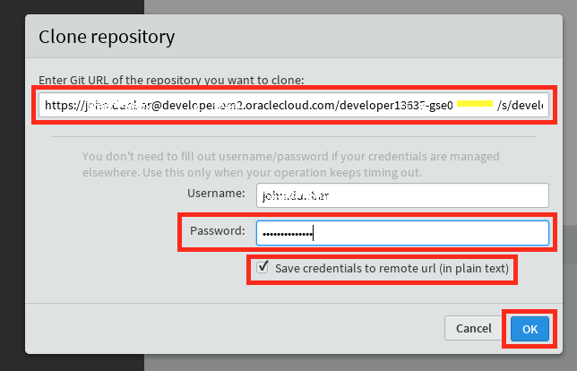

11. Wait for Brackets to clone your remote project to local folder.


12. You now have a local copy of the Git Repository.


### 2.2.2 Edit the source code to fit your environment

1. Open the server.js file (double click) in Brackets


2. In line 12, change the URL to your identity domain, i.e. in the format of **`http://<IP Address used in #1 JavaApp Lab>/ptmgt/v1/offer/`**. As you can see, this is the URL of the **Offer REST API Microservice**

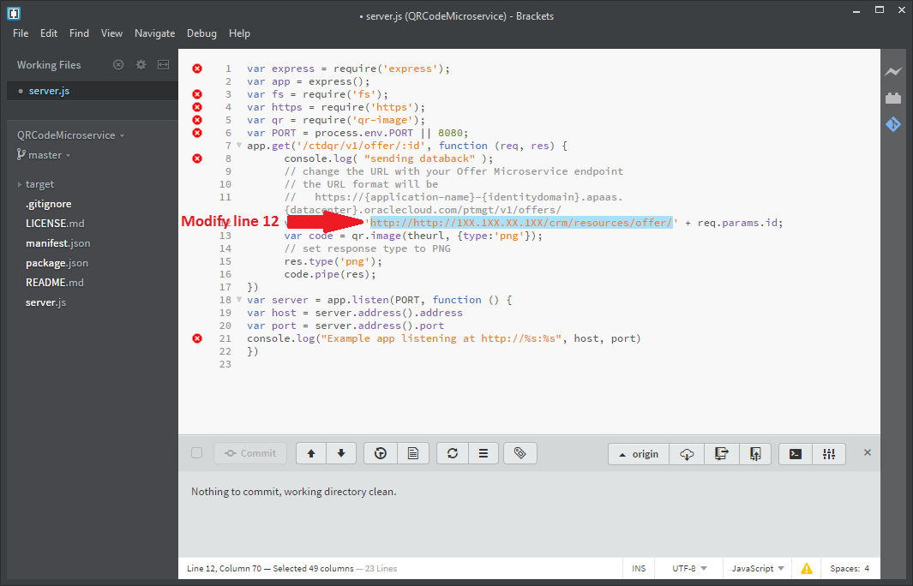

3. Save the file. (**Ctrl-S** or choose from pull-down menu **File > Save**)

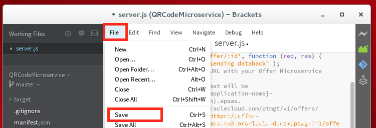

### 2.2.3 Create a new Branch and Commit

1. In the left hand navigation panel, select **master** and click **Create new branch...**


2. In the pop-up window, enter `ChangeURL` for branch name and click **Ok**


3. Check the box next to **Commit** to select all modified files - this means the checkbox below (server.js) will automatically be checked.

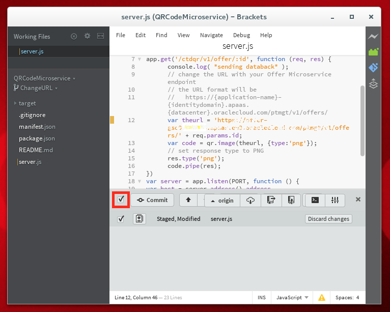

4. Click **Commit**

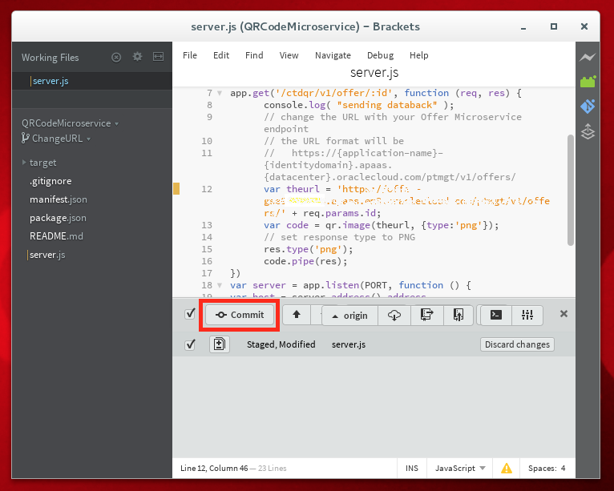

5. In the pop-up enter the **comment** `modify source code to use correct URL` and click **OK**. This will commit the changes to your LOCAL GIT REPOSITORY. (You can ignore the code inspection problems. You can review the code changes before confirmation)

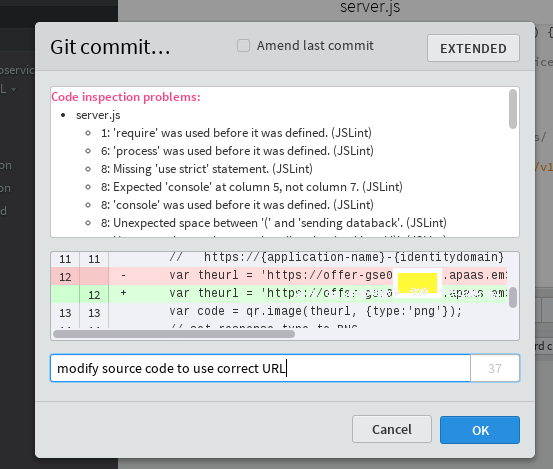

6. Click **Git Push** icon.

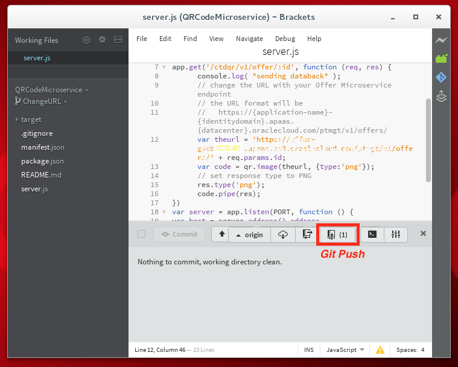

7. In the pop-up window, leave all defaults and click **Ok**.

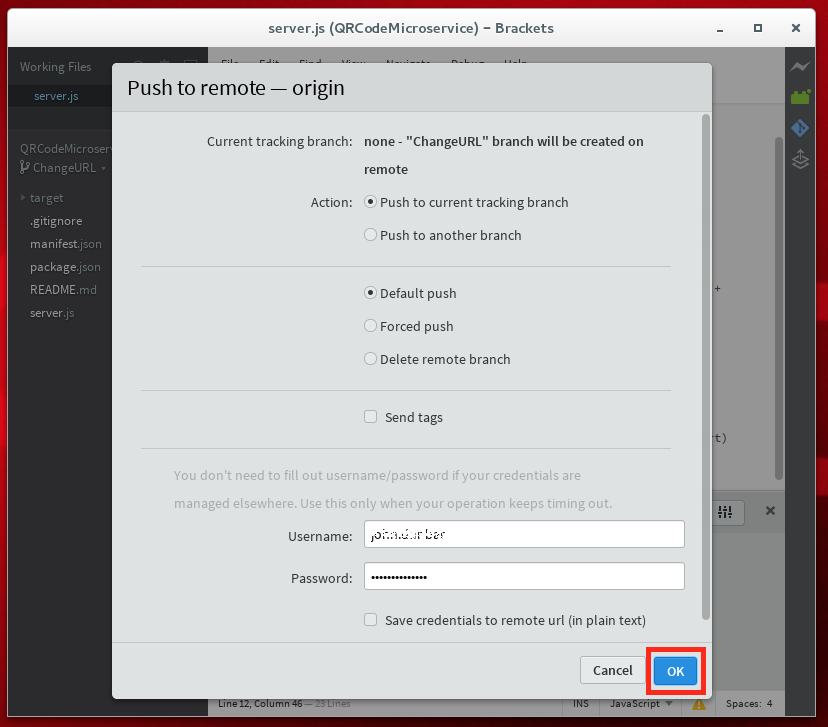

8. Once Git Push completes, click **Ok**


9. You have push the changes to Developer Cloud Service. If you like, you can go to **Developer Cloud Service** to check the pushed branch. You will something like this.


### 2.2.4 Create Merge Request in Developer Cloud Service to uptake the code

1. In Developer Cloud Service, click on **Code** tab. If you are not viewing the QRCodeMicroservice repo, change to the QRCode Repo.  


2. Select ChangeURL branch


3. Once you are in the ChangeURL branch. You should be able to view the recent commit that we made to branch from Brackets.

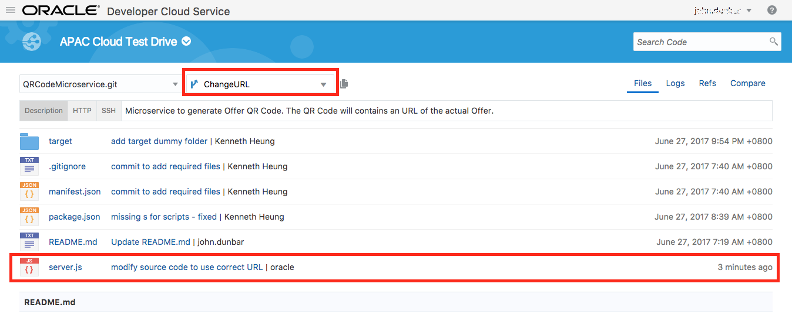

4. Now, a merge request can be created to merge the code - click on **Merge Requests** to go the merge request panel.


5. and then click on the **New Merge Request** button.

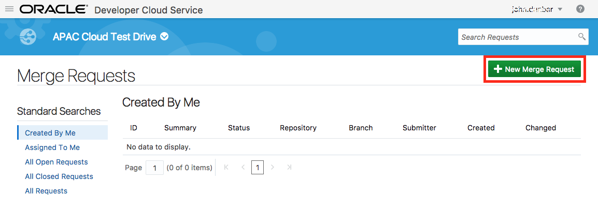

6. Enter the following information into the new merge request and click **Next**

  - **Repository:** `QRCodeMicroservice.git`
  - **Target Branch:** `master`
  -	**Review Branch:** `ChangeURL`


7. Enter for following information into **Details** and click **Next**

  - **Summary:** `Merge Request for branch ChangeURL`
  - **Reviewers:** `Choose the user you are working on` (e.g. Cloud Admin, John Dunbar, etc)

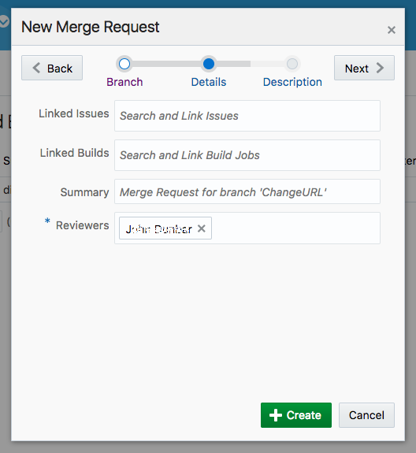

8. Review the request and click **[+ Create]** button.


9. Now, the merge request has been created. We will approve the request in the next section.

### 2.2.5 Merge the Branch

1. click on the **Merge Request**. Select the request we just created and we can review the request.

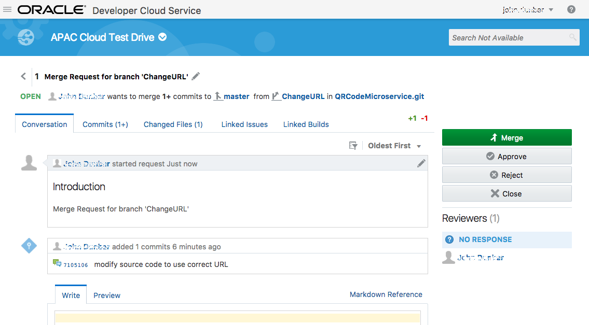

2. Once the request has loaded, select **Change Files** tab. Review the changes. You can add your comment before approve the request.

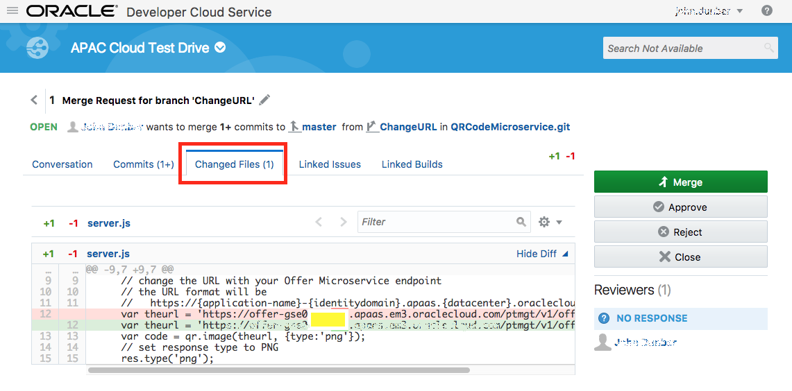

3. if you like you can click the **[Approve]** button to add comments

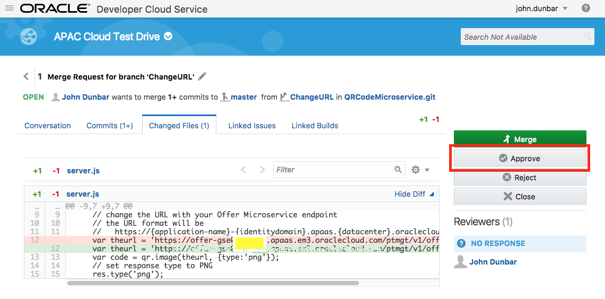

4. Enter some comments, e.g. `approved` and click **OK**.


5. You can see the request is now approved by reviewer. Click **Merge** button to proceed merging

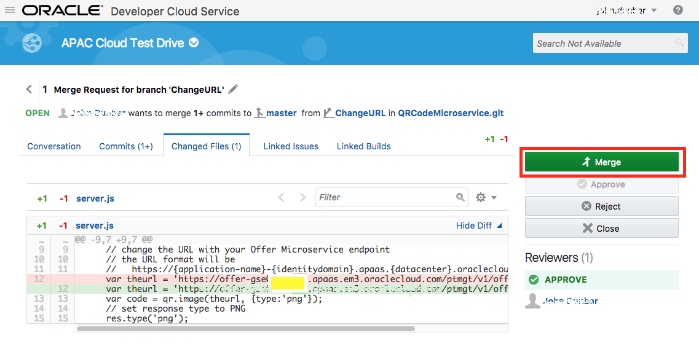

6. leave the defaults OR enter your desired comment. If you check **Delete branch**, the ChangeURL branch will be deleted after the merging. Click on **Create a Merge Commit** button.


7. Now the code merge had been committed and we can build the microservice. 	

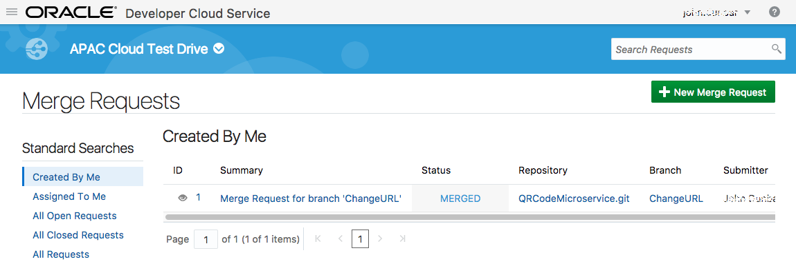

## 2.3 Create Default Build and Deployment Process - QR Code Generator

Now that we have the source code in our Developer Cloud Service managed Git Repository, we need to create a build process that will be triggered whenever a commit is made to the master branch. We will setup a **shell script** build process in this section.

### 2.3.1 Create Default Build Process - QR Code Generator

1. Click **Build** on the navigation panel to access the build page


2. Click **[+ New Job]**

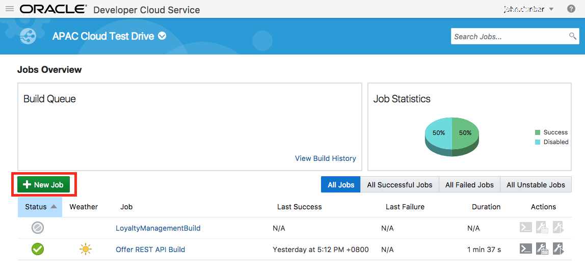

3. In the New Job popup window, enter `QR Code Generator Build` for Job Name and click **Save**.

```diff
-Please BE CAREFUL that you have not added extra white space before or after the information when copy-n-paste
```


4. You are now placed into the job configuration screen.


5. Click the **Source Control** tab. Select **Git** radio button. In the Repositories section, select **QRCodeMicroservice.git** from the URL drop down.

	**Note:** Make sure you select the Git repository for the QR Code Microservice.


6. Click **Triggers** tab. Check **Based on SCM polling schedule**.


7. Click the **Build Steps** tab, click **Add Build Step** and select **Execute shell**.


8. In the Command textarea, enter: `npm install`


9. Click the **Post Build** tab. Check **Archive the artifacts**. For File to Archive, enter `**/target/*` and verify **GZIP** is chosen as the Compression Type.


10. Click **Save** to complete the configuration.


11. A build should start automatically within 1-2 minutes. If it does not start automatically, click on the **[ Build Now ]** button.

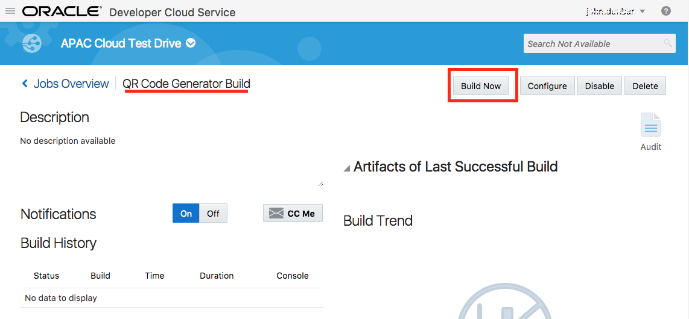

12. The status will change to something similar to the following diagram.


Building stage: please wait - it might takes a few minutes before the job change form queued to running


13. The build will take serval minutes to complete. Wait for the build to complete before continue to the next step - **as we need the build artifact to create the deployment configuration**.


### 2.3.2 Create Default Deployment Process - QR Code Generator

1. Click **Deploy** to access the Deployments page


2. Click the **[+ New Configuration]** button.

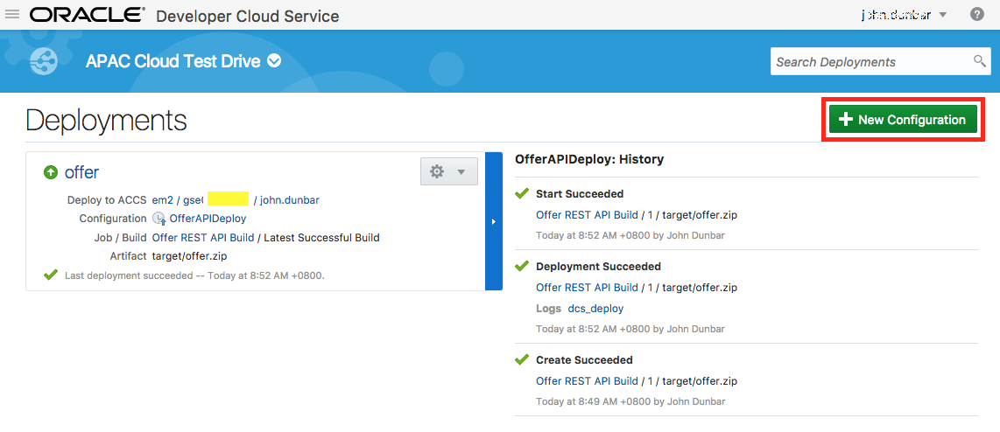

3. Enter the following data:

  - **Configuration Name:** QRCodeGeneratorDeploy
  - **Application Name:** qrcodegenerator
  
```diff
-Please BE CAREFUL that you have not added extra white space before or after the information when copy-n-paste
```


4. Next to the right hand side of **Deployment Target**, click the **[New]** button and select **Application Container Cloud...**

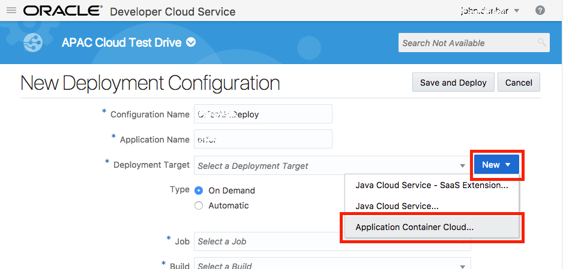

5. A window **Deploy to Application Container Cloud** will popup, confirm the information and **ENTER the password**, then click **[Test Connection]** button.   

  - **Data Center:** `your datacenter, e.g. em2, em3, etc`
  - **Identity Domain:** `your  Identity Service Id, which can be obtained from:`  
    Access to Application Container Cloud Service dashboard  
    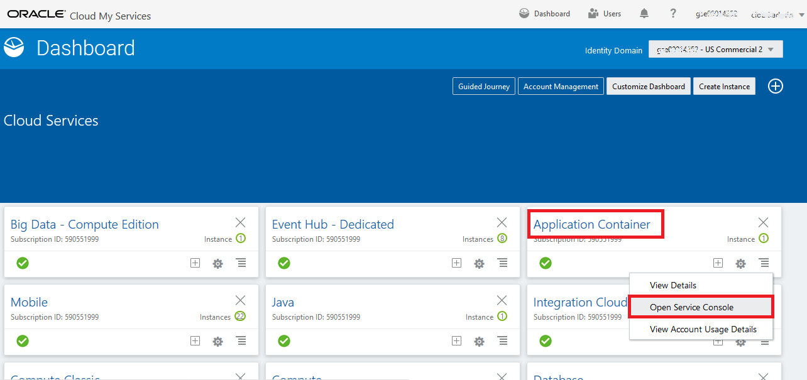
    Copy the `Identity Service Id` from the ACCS dashboard, and paste the Id into **Identity Domain** text box  
    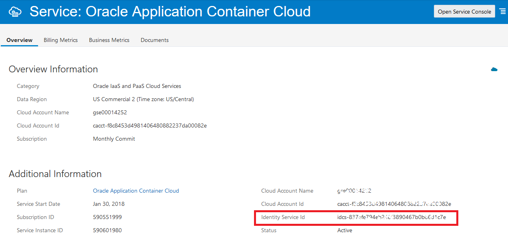
  - **Username:** `username to login to MyService, e.g. cloud.admin, etc`
  - **Password:** `password of the cloud user`

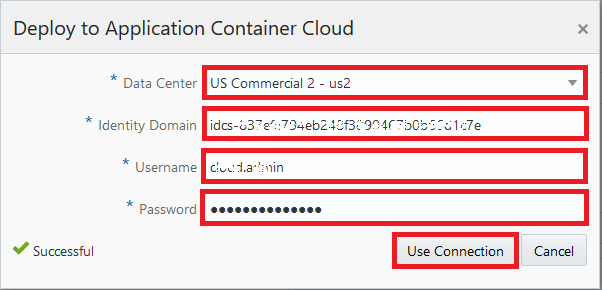

6. Once test is success, click **Use Connection**

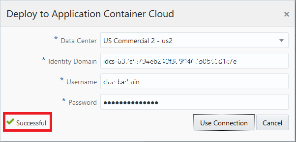

7. In the ACCS Properties, set

  - **Runtime** to `Node`
  - **Subscription** to `Hourly`
  - Set **Type** to `Automatic` and **CHECK** `Deploy stable build only`

**MAKE sure you select Node as the Runtime**


8. Select from the **Job**, this name should match the build job above, e.g. `QR Code Generator Build`. Select from the **Artifact**, this name should match the archive artifact above and the package.json of your source code, e.g. `target/qrcodegenerator.zip`  

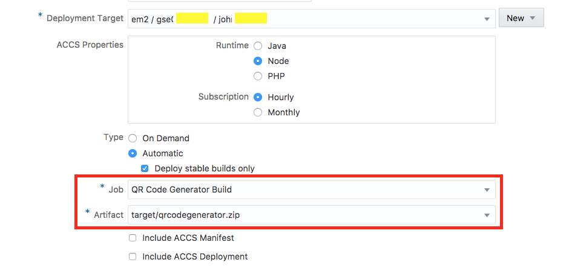

9. Check `Include ACCS Deployment` box and enter the following json

```json
{
	"memory":"1G",
	"instances":"1"
}
```


10. After fill in the above information, click **Save** button.

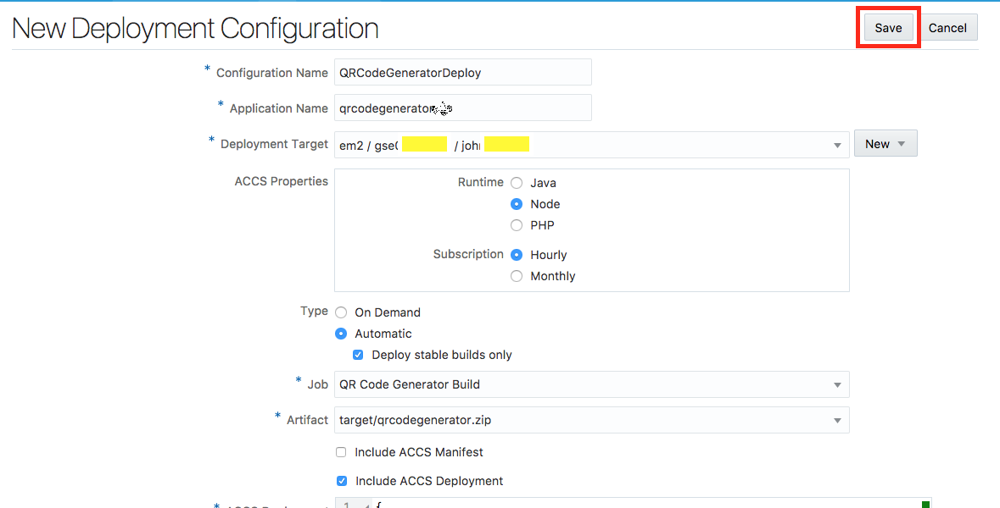

11. In your deployment job, click the gear drop down and select **Start**


12. The deployment job will be put into a queue for process. Wait until the message **Starting application** changes to **Last deployment succeeded**. Ask for help from your instructor if the deployment fails.


## 2.4 Login to Oracle Application Container Cloud Service

1. Navigate back to the Oracle Public Cloud tab. Click **Dashboard** to return back to main Cloud Service Dashboard.

2. On the Application Container Cloud Service (ACCS) click the humburger button and select **Open Service Console**


3. On the ACCS Service Console you can view all the deployed applications including our newly create **qrcodegenerator**.

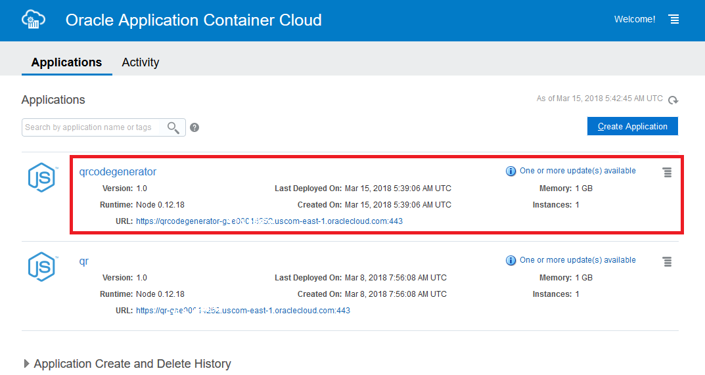

4. Copy the URL and paste it into the address bar of a new tab to bring up the application.

  Be reminded that you will need the REST endpoint and the **offer id** in order to generate a QR code.

  The final URL should looks like this

	{URL copied from ACCS Service Console}/ctdqr/v1/offer/10001  
	or  
	https://qrcodegenerator-{your-identity-domain}.{datacenter-location}.oraclecloud.com/ctdqr/v1/offer/10001

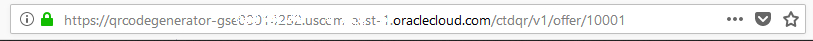		

5. the QR Code in the browser will look like this


```diff
+ you might want to copy your OWN URLs for QR Code API
+   {URL copied from ACCS Service Console}/ctdqr/v1/offer/
+   {URL copied from ACCS Service Console}
+ and put it in, e.g. Notepad
+   You will need to use it later, e.g. Lab 304 Step 27.
```

**OPTIONAL STEP:** if you use a QR Code reader (e.g. Mobile App), you can decode the QR Code

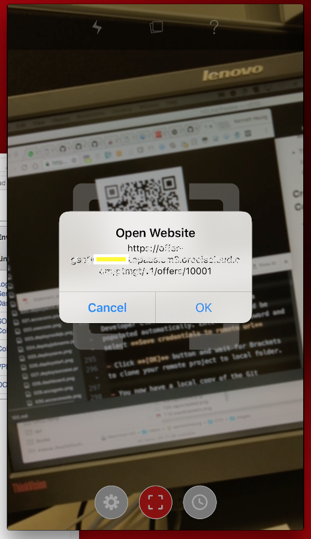

# Congratulation! You've completed the Microservice Lab.

[go back to the Cloud Test Drive Main Page](../README.md)
