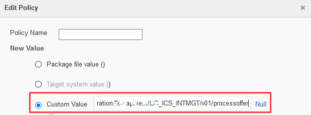

# ORACLE Cloud Test Drive #
-----
## 401: Import MBE package and configure connectors for external services ##

### Introduction ###

Connectors allow you to declaratively create APIs that simplify access to and standardize use of backend systems (such as enterprise middleware) and web services. OMCe provides different types of connectors to simplify integration with different types of backend systems, including REST connector, SOAP connector, Oracle Integration Cloud (OIC) connector, and Oracle Fusion Application connector. In this lab, you will use the REST connector to integrate with the three REST services that are created in the microservices and integration labs.

Once connectors have been created, they can be used in custom APIs (e.g. the Loyalty Mgmt APi that you will create later), and exposed to mobile applications.

### About the Exercise Today ###
There are 3 connectors to be created in this lab, 2 of them integrate with the microservices on ACCS to query offers and generate QR code, while the last connector integrates with the service on OIC to accept or reject offer and update the existing CRM.

To create the above 3 Connectors, you will:
- Import the MBE package, which include the 3 connectors, together with the custom API and mobile backend that you will verify and configure later.
- Configure the connectors to use the correct URLs and credential to integrate with the backend services.
- Take "Process Offer" connector as an example, test and verify the result of the connector

### Prerequisites ###
- Completed 'microservices' and 'integration' labs to expose services on ACCS and OIC respectively.

#### Import the MBE package ####

1. Following the **Lab 4xx Mobile** section of Access Document, click on the given URL:

6. After login with your **Cloud Account with Identity Cloud Service** username and password, the OMCe home page is shown:

7. In OMCe Portal, click on the hamburger icon located at the left top corner of the service introduction page. From the navigation pane, select “Mobile Apps” -> “Packages”, and click on the “New Import” green button.

8. Click on "Choose a package file " and select the MBE package file "package-LoyaltyMgmt_MBEXX.zip" with the correct postfix assigned to you.

9. Once the file has been uploaded, click 'Next'.

10. On the 'confirm' step, the contents of the package are shown. The package should include Mobile Backend 'LoyaltyMgmt_MBEXX', Client 'MyAndroidClientXX', API 'LoyaltyMgmtXX', API implementation 'LoyaltyMgmtXX', and 3 connectors 'GenerateQRCodeXX', 'ProcessOfferXX', and 'QueryOffersXX'. Make sure the postfix is correct in each object to be imported. Click 'Next'

11. On the 'Import Results' step, verify all objects have been imported successfully. Click 'Next'.

12. On the 'Policies' step, select the policy '*.connector/GenerateQRCodeXX(1.0).Connector_Endpoint' and click on 'Edit'.

13. Set a custom value as the Host URL of the QR code service deployed on ACCS, e.g. `https://qrcodegeneratorXX-<ACCS_DOMAIN_NAME>.<DATACENTER_LOCATION>.oraclecloud.com`. Click 'Save'.

14. Back in the 'Policies' step, select the policy '*.connector/QueryOffersXX(1.0).Connector_Endpoint' and click on 'Edit'.

15. Set a custom value as the Host URL of the offer service deployed on JCS, e.g. `http://<IP Address of LoyaltyMgmt in #1 JavaApp Lab>`. Click 'Save'.  

16. Back in the 'Policies' step, select the policy '*.connector/ProcessOfferXX(1.0).Connector_Endpoint' and click on 'Edit'.

17. Set a custom value as the full service URL of the 'Process Offer' service deployed on OIC, e.g. `https://<OIC_INSTANCE_NAME>-<OIC_DOMAIN_NAME>.<DATACENTER_LOCATION>.oraclecloud.com/ic/api/integration/v1/flows/rest/CXX_ICS_INTMGT/1.0/processoffer`. Click 'Save'.  

18. Back in the 'Policies' step, verify that you have successfully set new values for all three connector endpoint policies, and click 'Update' to complete importing the package.

#### Configure credential to access 'Process Offer' service on OIC ####
The 'Process Offer' service deployed on OIC is configured to use 'Basic Authentication' in the 'integrations' lab. To integrate with the 'Process Offer' service, you should configure the OIC credential on OMCe so that the connector on OMCe is authorized to access the 'Process Offer' on OIC.

1. From the navigation pane, click to expand “Settings” and click "Credentials". In the Credentials page, click on `+ New CSF Key` button.  

2. In the **New CSF Key** area, enter the following information:  

  - **Key Name**: ICSXX (XX is your assigned postfix)
  - **Short Description**: ICSXX (Same as above or meaningful description)
  - **User Name**: username used for Integration Cloud
  - **Password**: password used for Integration Cloud
  - **Confirmed Password**: Same as above
  
Click `Save` button.

3. A new CSF Key with your given name is shown on the credentials list.

#### Test the connector 'Process Offer' ####

Once the connectors have been imported and configured completely, you can test the connector. In this lab, you will test the connector 'Process Offer'.

1. On the navigation pane, select “Mobile Apps” -> “Connectors”. Enter "XX" (XX is the postfix assigned to you) to search for the connectors created by you. Select "Process Offer XX" (XX is the postfix assigned to you) and click on "Open".

2. In 'General' step, make sure that the 'API Name' is set as 'ProcessOfferXX' (0X is the postfix assigned to you), and click 'Next'.

3. In 'Descriptor' step, make sure that the 'Remote URL' is set to the full service URL of the 'Process Offer' service on OIC, e.g. `https://<OIC_INSTANCE_NAME>-<OIC_DOMAIN_NAME>.<DATACENTER_LOCATION>.oraclecloud.com/ic/api/integration/v1/flows/rest/CXX_ICS_INTMGT/1.0/processoffer`. Click 'Next'.

4. In 'Rules' step, click 'Next' as no rule is used. 

5. In 'Security' step, make sure that security policy "oracle/http_basic_auth_over_ssl_client_policy" is selected, and the csf-key is set to 'ICSXX' (XX is the postfix assigned to you). Click 'Next'.

6. If `Confirm Save Before Testing` dialog window prompt, click 'Yes' to save.

   

7. In 'Test' step, select `POST` as the HTTP method, enter `{"customerid": 66890169,  "offerid": 10001,  "productid": 20001,  "accepted": false}` into the "HTTP Body".

8. Select your mobile backend (e.g.: `LoyaltyMgmt_MBEXX`) you created from the dropdown list in the “Authentication” section, select “Anonymous” user and click on “Test Endpoint”.

9. You shall see an HTTP 200 OK response at the bottom of the page and it is all set.

You have finished this lab successfully.

[Procced to Next - 402: Verify and test custom APIs and implementation](402-MobileLab.md)

or

[Back to Mobile Service and Application Home](README.md)
