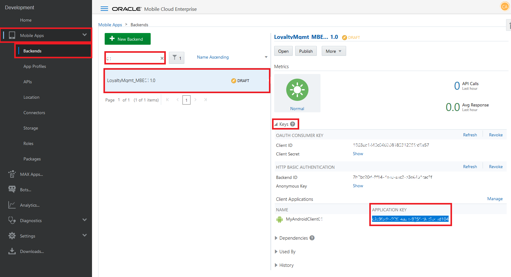
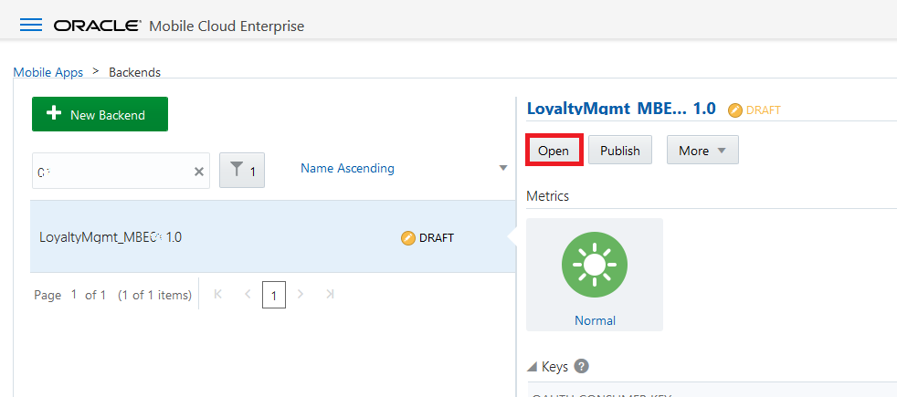
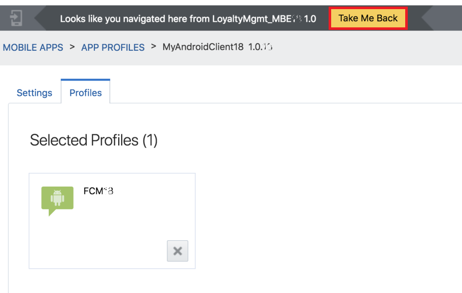

# ORACLE Cloud Test Drive #
-----
## 403: Set up Push Notification and configure the mobile app ##

### Introduction ###
You can use the Notifications service (part of OMCe platform APIs) to send notifications to users of the apps registered in a mobile backend. Once you have the mobile backend set up for notifications, the process of sending the notifications is the same for both iOS, Android, and Windows apps. You set up notifications by obtaining the appropriate vendor certificates and registering them with the app's mobile backend. In addition, you can write your own code in the mobile app to process the push notification. OMCe can also exposed the push notification service to other applications, so that applications, e.g. the Java App for campaign management, can send out push notification to end user by calling the push notification service exposed by OMCe.

### About the Exercise Today ###
In this exercise, we will:
- Create a notifications profile
- Configure the mobile app to work with your Mobile Backend
- Test Notification

### Prerequisites ###
- Installed Cafe Supremo app on your Android device

----
#### Create a notifications profile ####
A notification profile defines the certificate or keys that is required by push notification providers to send out push notifications. 
In this lab, you will create a notifications profile and associate the that with the client application (Cafe Supremo mobile application), so that OMCe can send push notification to the Cafe Supremo mobile application.

1. On the navigation pane, select “Mobile Apps” -> “Backends”. Enter "XX" (XX is the postfix assigned to you) to search for the mobile backend imported by you. Select "LoyaltyMgmt_MBEXX" (XX is the postfix assigned to you) and click on "Keys" arrow to expand the section.

You should see a client called "MyAndroidClientXX". Scroll right to find the "Application Key" column.

2. **Copy the values of "Application Key" and replace the value of the property "applicationKey" in the "Mobile_App_Settings_Sample.json" file.**  Save the file for later use.

3. Click "Open" button to drill down into the Mobile Backend detail.

4. Click "Clients" on Mobile Backend left pane and then click the client named "MyAndroidClientXX".

5. Switch to the "Profiles" tab of the "MyAndroidClientXX" client, and click on "New Profile" button to create the notification profile.

6. Enter `FCMXX` (change `XX` to the postfix assigned to you, e.g: 03) as the "Name. Paste `AAAA14t0nbs:APA91bHtR-V_lZEcMgaEFIJd_UrybuBjNyPG4N0ZoA33UqbZ9CywL_e2FnIfoS9lvPV5gut3Mm_ZMoex7PE1-YL-7ACaP3CnrDYpl8Qq3_jfsO3HMJYS-Mzr_X-xWpgdqWswVHsSUgDX` as the "API Key" and `925757644219` as the "Sender ID". Keep `Google Messaging (GCM or FCM)` as the "Notification Service" and `XMPP` as the "Send Method", and click on “Create”. (These are the keys that are generated from Google.)

   

7. The notification profile has been created and associated with the your client "MyAndroidClientXX". Click on the link "< LoyaltyMgmt_MBEXX" in the navigation bar to navigate back to the mobile backend.

8. Verify that your client is "Notification Enabled".

---
#### Configure the mobile app to work with your Mobile Backend ####
You mobile app should be configured to work with your mobile backend before you can run any testing on the app. You will use the file **Mobile_App_Settings_Sample.json** to collect the settings that is needed to configure the mobile app.

1. Switch to the "Settings" tab of your mobile backend, and find the values of "Mobile Backend ID", "Anonymous Key" and "Base URL" in the mobile backend settings.

2. Copy the values from the mobile backend settings and replace the value of the target property in the "Mobile_App_Settings_Sample.json" file.  You should copy and replace the following properties.

| From Property in MBE Settings | To Property in JSON File |
|-------------------------------|--------------------------|
| Mobile Backend ID             | backendId                |
| Anonymous Key                 | anonymousToken           |
| Base URL                      | baseUrl                  |

3. Copy the values of the mobile user name and password to replace the values of the "LoginUser" and "LoginPassword" property in the "Mobile_App_Settings_Sample.json" file.  This allows the Cafe Supremo mobile app to set the "LoginUser" and "LoginPassword" as default user name and password in the login form of the mobile app. Finally your "Mobile_App_Settings_Sample.json" file should be like this.

4. The Cafe Supremo mobile app allows reading new settings by scanning a QR code. You will generate a QR code with the settings in the "Mobile_App_Settings_Sample.json" file, and scan the QR code from the mobile app. 

5. From your web browser, go to `http://www.qr-code-generator.com/`, click on `Text` button and the **Free text** text area is shown.

6. Copy the settings in **your own** "Mobile_App_Settings_Sample.json" file and paste it into the **Free text** text area, then click `Create QR code` button. A QR code image will be generated on the right hand side of window.

7. From your mobile device, open the app 'Cafe Supremo'.

   

8. **DO NOT LOGIN.**  Click on the hamburger menu on top left corner, and click "Settings".

   

9. On Settings page opened, click `Read Settings from QRCode` button at middle.

   

10. When the QR scanner running, face your mobile device towards the QR code image you created in step 6. You may need to adjust the distance between your mobile device and your screen until the scanner camera can recognize the QR image.

   

11. On successful QR code scanning, all settings in your JSON file will be automatically filled into the mobile app Setting page like below. Click `Save settings and logout` button. You will then be returned to home screen.

   

12. The "Username" and "Password" in the login form have been pre-filled as what you have in the settings in your JSON file. If the user name and password are correct, click `Login` button to login. Otherwise, you can type in the user name and password manually.

   

13. Upon successful login, the welcome page is shown. Your mobile device is now ready to receive push notification of campaign offer.

   

---
#### Test Notification ####
1. Switch to “Notifications” tab in your mobile backend and click on the icon below “4 TEST”.

   

2. Click on "Manage Devices".

   

3. You shall see devices that has been registered to this mobile backend. Click on “Close” and go back to the “Test” screen.

   

4. Before sending the notification, make sure your "Cafe Supremo" mobile app is running in the **Background** on your Android device.

5. Enter a notification `You can use your points to buy products! – 10001` with send option `Now` and click on “Send”. Note you will be getting errors if no devices registered yet.

   

6. If you have at least one device registered, you shall see a success message pop up on top of the page and the notification shall appear in the notification area of your device.

   

   

[Procced to Next - 404: Track customer behaviors (Optional)](404-MobileLab.md)

or

[Back to Mobile Service and Application Home](README.md)
