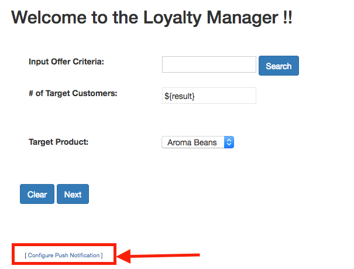
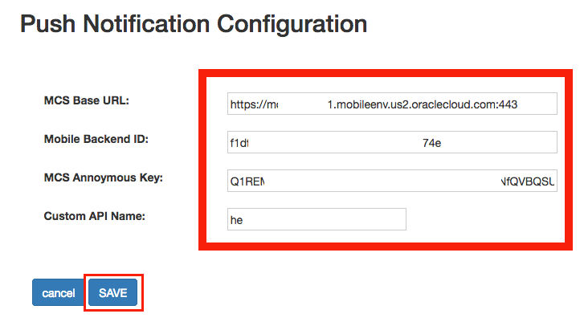

# ORACLE Cloud Test Drive #
-----
## 501: Update Settings for Sending Push Notification from JEE Application to Mobile Cloud Service ##

### Introduction ###
On the completion of Lab 4 - Mobile Service and App, you should be able to run the 'Cafe Supremo' app on Android device and configured all necessary mobile backend services. Customer using Cafe Supremo app can logon, explore personalized promotion and menu.  
Rather than having the customer periodically checks the latest new promotion offer, the company wants to actively notify customers. An app-based push notification will be sent to those who already installed the 'Cafe Supremo' app, upon a new offer is created by marketing manager. Therefore, we will need to connect the Loyalty Management JEE application to Oracle Mobile Cloud, Enterprise (OMCe) by calling a messaging notification API.


### About the Exercise Today ###
In this exercise, we will:
- Modify the Push Notification settings in the JEE Application
- Call OMCe API to send push notification from JEE application to mobile device

### Prerequisites ###
+ Completion of all previous 4 lab exercises: [Java Apps](../Java%20Apps/README.md), [Microservices](../Microservices/README.md), [Integration](../Integrations/README.md) and [Mobile](Mobile%20Service%20and%20App/README.md)


----

#### Prepare Mobile Device to Receive Push Notification ####

1. By the end of previous lab [404: Set up Push Notification and Test Push Notification to mobile app](../Mobile Service and App/404-MobileLab.md), you should be able to receive notification message pop-up from your mobile device upon **Test Notifications** from OMCe like below. (Please check with instructor if you cannot complete lab exercise 404)


2. Launch the mobile app and enter the **Username** and **Password** provided by instructor, then click `Login` button.


3. Upon successful login, the welcome page is shown. Your mobile device is now ready to receive push notification of campaign offer.


#### Modify Java App Push Notification Configuration

1. Go to home page of the Loyalty Management application. The Loyalty Management application URL should be in the format of:  
`https://**<JCS WLS instance IP Adress>**/loyalty/jsp/welcome.jsp`  

  Click the [ **Configure Push Notification** ] URL at the bottom of the page



2. Update the OMCe Notification Setting with respect to your environment - the values are available in the Mobile_App_Settings_Sample.json you've prepared previously in Step 2 of Lab 404.
    - OMCe Base URL: `your OMCe baseUrl, https://XXXXXXX.<OMCe-Datacenter-Location>.oraclecloud.com:443`     
    - Mobile Backend ID: `backendId in the json file`    
    - OMCe Anonymous Key: `anonymousToken in the json file`    
    - Custom API Name: `API in the json file, LoyaltyMAnagementAPIXX`    

    Your json file should looks similar to this - **of course the vales are different**
    ```json
    {
          "baseUrl": "https://XXXXXXX.uscom-central-1.oraclecloud.com:443",
          "applicationKey": "9722de7f-4ecf-443f-8e0e-714b2f6e0f9c",
          "backendId": "4a9d0d32-8aad-48fb-b803-5315459dce9f",
          "anonymousToken":  "R1NFMDAwMTE2NzhfTUNTX01PQklMRV9BTk9OWU1PVVNfQVBQSUQ6Smk3cXBld3lrczlfbmI=",
          "API":"LoyaltyManagementAPIXX",
          "senderID":"925757644219"
    }
    ```

    When Copy-n-Paste to the web form, be careful
      - do NOT add white space   
      - you copy and paste the **COMPLETE** value     
  Click [ **SAVE** ] button to save your new settings.



3. Once the Push Notification Settings are saved, you can proceed to next lab.


Your Loyalty Management JEE Application is now ready to create campaign offer and notify customer mobile device.

You have finished this lab section.

[Procced to Next - 502: End-to-End Testing](502-PuttingAllTogetherLab.md)

or

[Back to Putting All Together Lab Home](README.md)
